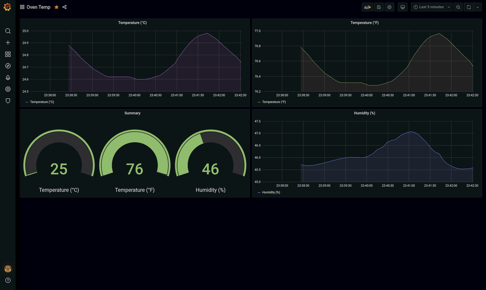
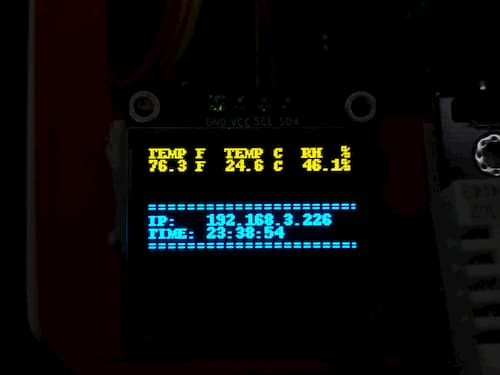
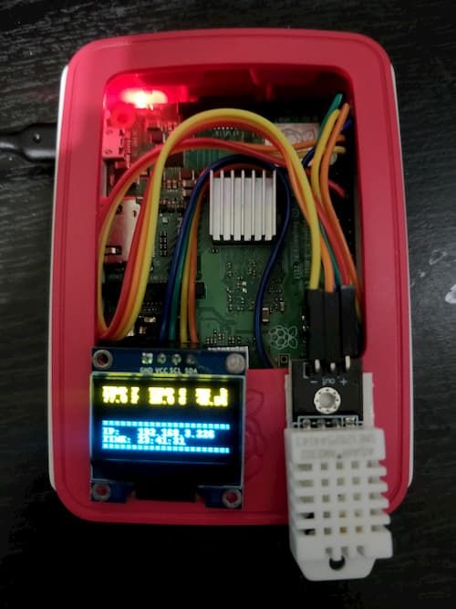

# 🌡 Oven Temp

Just a simple temperature monitor.

## ✨ Features

- ⚡ 128x64 OLED display over I2C to display environment data and IP address.
- 🌡 DHT22 temperature sensor to get environment data.
- 📈 Grafana + InfluxDB to log and graph data (😍 📈📉📊).
- 🐳 Also, it uses docker 😏.

## Images





## 🔌 Wiring

| Pi Pin              | Device  | Device Pin |
| ------------------- | ------- | ---------- |
| 1 (3V3)             | SSD1306 | VCC        |
| 3 (GPIO 2 - SDA)    | SSD1306 | SDA        |
| 5 (GPIO 5 - SCL)    | SSD1306 | SCL        |
| 6 (GND)             | SSD1306 | GND        |
| 7 (GPIO 4 - GPCLK0) | DHT22   | OUT        |
| 17 (3v3)            | DHT22   | VCC        |
| 9 (GND)             | DHT22   | GND        |

## 🔧 Setup

### General Pi Setup

Setup locales, update default passwords, run updates and such. You know, the general setting up a new Pi stuff.

### Enable I2C and SPI

- Enable I2C and SPI in the "Interfacing" menu of `raspi-config`.
- Reboot.

### Install Docker

You can install docker and run containers wherever you want, on the Pi, or another host. The code assumes `localhost` be default for the InfluxDB connection.

Installing docker on a Pi running Rasbpian is easy:

```sh
curl -fsSL https://get.docker.io | sudo bash
sudo apt install -y docker-compose # the install script does not include compose :(
sudo usermod -aG docker pi # should take affect after a re-login
```

### Python Bits

Install dependencies

```sh
sudo apt install -y python3-pip libopenjp2-7 libtiff5
sudo pip3 install --no-cache-dir rpi.gpio influxdb adafruit-circuitpython-ssd1306 Pillow Adafruit_DHT python-dotenv
```

Download the repo

```sh
sudo apt install -y git
git clone https://github.com/bmiddha/oven-temp
```

Copy the systemd service. The service assumes that the repo is cloned in `/home/pi`, change the service file if repo is located in another location.

```sh
sudo cp oven-temp.service /etc/systemd/system # in the oven-temp dir
```

### Bringing everything together

Start the Grafana and InfluxDB services

```sh
docker-compose up -d # in the oven-temp dir
```

Start and enable service

```sh
sudo systemd enable --now oven-temp.service
```

### Dashboard Setup

- Open a browser to `http://RASPBERRY_PI_IP:3000/` to access Grafana. Default credentials are admin, admin.

- Add a new datasource for InfluxDB with the host as `http://influxdb:8086`, access as "Server" and the database, username, password details based on configuration. Might be worthwhile adding a read-only user for Grafana using the `INFLUXDB_READ_USER`, and `INFLUXDB_READ_USER_PASSWORD` environment variables.


- Now you can make cool graphs! 📈😎📉
